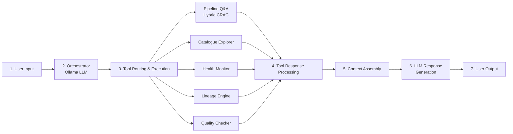
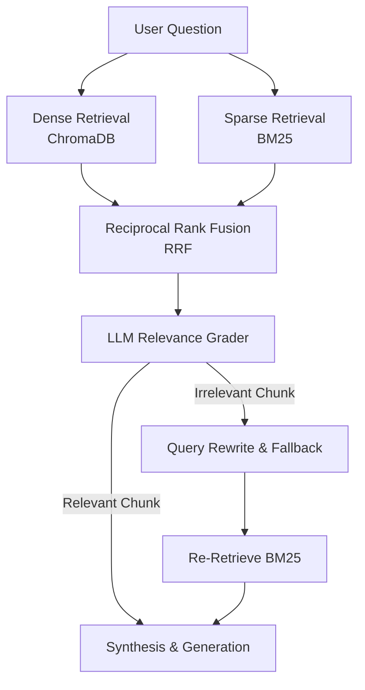

# Technical Architecture Flow

This document details the architecture flow of the **RAG-Powered Data Engineering Assistant**, custom-built to run locally with **Ollama** as the core LLM orchestration engine.

---

## 1. End-to-End System Workflow

The system follows a modular 7-step horizontal processing loop to parse questions, query metadata/docs, and generate grounded answers.

### Detailed Steps

1. **User Input**
   - **Interface**: Sleek Streamlit dashboard chat interface.
   - **Input**: Natural language user queries regarding pipeline configurations, scheduling, dataset lineage, or operational health.

2. **Orchestrator (Ollama LLM)**
   - **Engine**: Local **Ollama** instance (running `llama3.1:8b` or configured model).
   - **Logic**: Evaluates conversation history and user query intent to select the most relevant tool(s) to execute.

3. **Intelligent Tool Routing & Execution**
   - **Pipeline Q&A (Hybrid CRAG)**: Answers documentation questions using vector search and corrective fallback query rewrites.
   - **Catalogue Explorer**: Searches schemas, PII tags, and metadata inside JSON table catalogs.
   - **Health Monitor**: Evaluates run history and computes SLA/SLO metrics.
   - **Lineage Engine**: Traverses upstream and downstream dependencies.
   - **Quality Checker**: Simulates and validates data expectations (null rates, row counts, schema drift).

4. **Tool Response Processing**
   - Aggregates and structures outputs, payloads, and execution logs from the invoked tool modules.

5. **Context Assembly**
   - Combines clean tool outputs, document citations, metadata tags, and query parameters into a structured prompt context for LLM synthesis.

6. **LLM Response Generation (Ollama LLM)**
   - Translates technical data payloads into clean, natural language answers, ensuring accurate references and document citations.

7. **User Output**
   - Renders the finalized, formatted answer with citation links directly inside the Streamlit chat UI.

---

## 2. Hybrid Corrective RAG (CRAG) Pipeline

For questions regarding documentation and runbooks, a advanced **Corrective RAG** pipeline is executed to maximize accuracy and eliminate hallucinations.

* **Dense Retrieval (ChromaDB)**: Performs semantic vector similarity search using `all-MiniLM-L6-v2` embeddings.
* **Sparse Retrieval (BM25)**: Performs keyword-based search over documents.
* **Reciprocal Rank Fusion (RRF)**: Merges dense and sparse ranks to combine semantic context and exact keywords.
* **LLM Relevance Grader**: Evaluates chunk relevance. If irrelevant, triggers query rewriting.
* **Query Rewrite & Fallback**: Rewrites queries and retrieves fallback content to guarantee high context recall.

---

## 3. Data Retrieval & Sources

The underlying data storage layer is completely local and file-based, requiring no complex external database setups:

* **Markdown Documentation**: Located in `data/pipeline_docs/` (contains runbooks, Bronze/Silver/Gold SOPs, and architecture decisions).
* **JSON Catalogues & Metadata**: Located in `data/catalogue/tables.json` (contains table schemas, row counts, and PII tags).
* **Pipeline Run History**: Located in `data/health/pipeline_runs.json` (contains logs and execution durations).
* **Lineage Data**: Located in `data/catalogue/lineage.json` (contains DAG relationship nodes).
* **Quality Configuration**: Located in `data/health/slo_config.json` (contains SLO targets).
